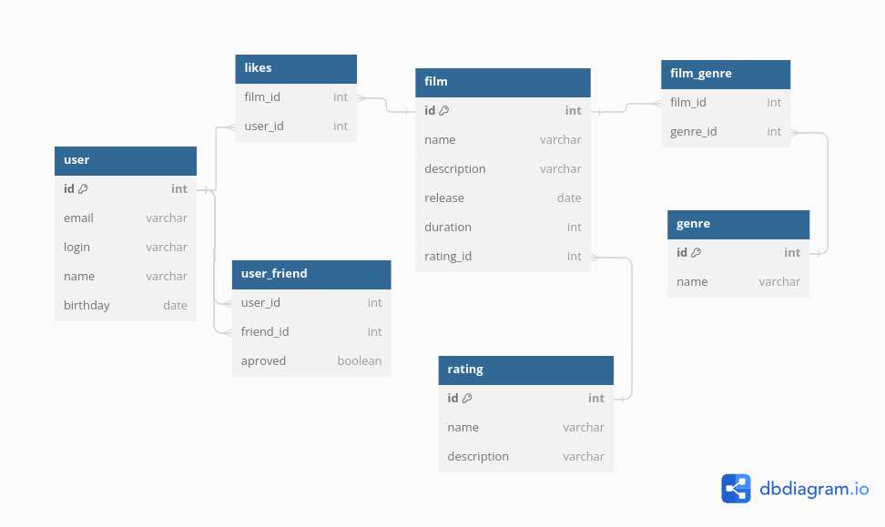

# java-filmorate
Template repository for Filmorate project.


#### user -пользователь  
#### film - фильм  
#### genre - справочник жанров  
#### rating - справочник рейтингов  
#### user_genre - связь пользователя с жанрами  
#### user_friend - связь пользователся с друзьями  
#### likes - лайки  

#### Получение всех пользователей
```sql
SELECT * FROM user;
```

#### Получение пользователся по id
```sql
SELECT * FROM user
WHERE id = [юзер]
```

#### Получение списка друзей
```sql
SELECT *
FROM user
WHERE id in (
    SELECT uf.friend_id 
	FROM user u
	JOIN user_friend uf ON uf.user_id = u.id
	WHERE u.id = [юзер]
	) 
```

#### Получение общих друзей
```sql
SELECT *
FROM user
WHERE id in (
	SELECT uf.friend_id
	FROM user_friend uf
	JOIN user_friend ouf ON uf.friend_id = ouf.friend_id
	WHERE uf.user_id = [первый юзер]
	AND ouf.user_id = [второй юзер]
	)
```
	
#### Получение всех фильмов
```sql
SELECT * FROM film
```

#### Получение самых популярных фильмов
```sql
SELECT f.id, count(l.user_id)
FROM film f
JOIN likes l ON f.film_id = l.film_id
GROUP BY f.id
ORDER BY count(l.user_id) desc
LIMIT [количество]
```
